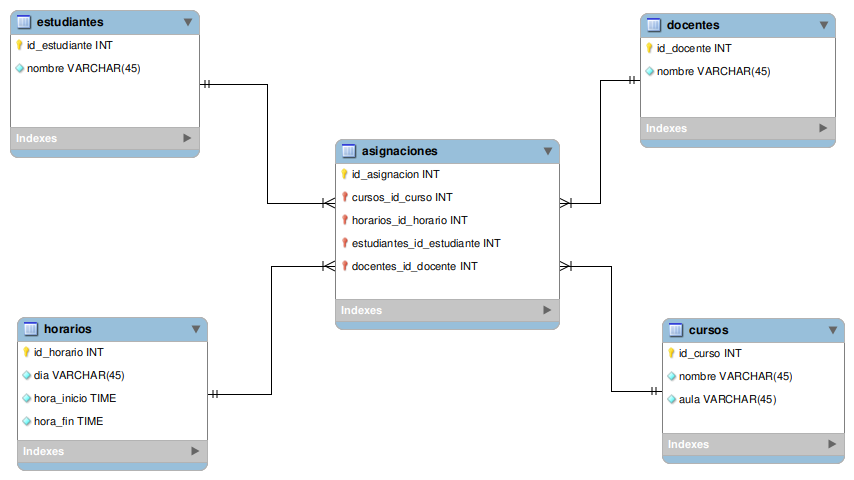

# Sistema de Asignaciones

## Descripción

Este proyecto consiste en la creación de una base de datos para organizar la información de estudiantes, docentes, cursos y horarios.

El objetivo principal fue aplicar la normalización para evitar la duplicación de información y mantener los datos organizados.

---

## Diagrama de la base de datos

---

## Tablas utilizadas

La base de datos está formada por las siguientes tablas:

### Estudiantes

Guarda la información de los estudiantes.

- `id_estudiante`
- `nombre`

### Docentes

Guarda la información de los docentes.

- `id_docente`
- `nombre`

### Cursos

Guarda la información de los cursos y el aula donde se imparten.

- `id_curso`
- `nombre`
- `aula`

### Horarios

Guarda los días y horarios de las clases.

- `id_horario`
- `dia`
- `hora_inicio`
- `hora_fin`

### Asignaciones

Esta tabla relaciona a los estudiantes, docentes, cursos y horarios mediante claves foráneas.

- `id_asignacion`
- `cursos_id_curso`
- `horarios_id_horario`
- `estudiantes_id_estudiante`
- `docentes_id_docente`

---

## Normalización

En este proyecto se aplicaron diferentes formas normales para organizar correctamente la información.

### Primera Forma Normal (1FN)

**Explicación:**

Honestamente al principio pensé en que no sería necesario aplicar la primera forma normal, ya que los valores 
a primera vista parecían estar de uno en uno, sin embargo, después pude notar que la búsqueda en horario sería complicada y poco escalable si en algún momento necesitara hacer una búsqueda por horario, por día, por hora, por mes, entonces no lograría hacer las consultas de manera correcta si los valores se almacenaban como lo ví en un principio. Entonces si fue necesario aplicar la primera forma normal para separar el día, de las horas. Ahora puedo buscar y hacer consultas con las horas, saber cuál es el primer horario, cuantos cursos hay en el primer horario, etc.

### Segunda Forma Normal (2FN)

**Explicación:**

Se eliminaron las dependencias parciales, ya que la llave primaria cursos sostenía toda la información, parcialmente cada campo estaba dependiendo de id curso, cuando podría separar el estudiante en su tabla, el curso en su tabla, y hacer que ningún dato dependiera solo de una parte de la clave.

### Tercera Forma Normal (3FN)

**Explicación:**

En la tercera forma normal, ya cada entidad estaba separada en su tabla individualmente, y cree la tabla asignaciones para poder relacionarlos y que todos dependieran de la llave primaria. Ahora la tabla asignaciones almacena las claves necesarias para relacionarse y permitir la búsqueda y las consultas de manera flexible, evitando las dependencias transitivas y la repetición de información.

### Cuarta Forma Normal (4FN)

**Explicación:**

A la hora de aplicar la primera forma normal a la tercera, de la forma en que lo hice, no me encontré con un problema de valores multivaluados. Consideré la posibilidad de aplicarlo al ver cómo me quedó horario, sin embargo, considero que solo son muchos valores que son necesarios, pero no necesariamente se repiten sin un objetivo, porque no sería lo mismo un martes de 8 a 10 que un miércoles de 8 a 10, crear más tablas solo lo complicaría y no estaría aplicando el objetivo de la 4fn. No pude realmente identificar posibles dependencias multivaluadas al pasar a la 3fn.

###**Consultas DQL**

Las siguientes consultas utilizan SELECT y JOIN para obtener información relacionada entre las tablas.

1. Ver estudiantes y sus cursos

Esta consulta muestra el nombre de los estudiantes y los cursos a los que están asignados. Se beneficia de la normalización porque los nombres de estudiantes y cursos están almacenados en tablas separadas y se unen mediante sus IDs.

2. Ver docentes y cursos

Esta consulta muestra los docentes y los cursos relacionados con ellos. La normalización evita repetir el nombre del docente y del curso en cada asignación, ya que esta información se guarda en sus respectivas tablas.

3. Ver estudiantes y horarios

Esta consulta muestra a los estudiantes junto con el día de su horario. Se beneficia de la normalización porque el horario se guarda en una tabla independiente y se relaciona mediante una clave foránea.

4. Buscar estudiantes de Redes

Esta consulta busca únicamente a los estudiantes asignados al curso de Redes. Se beneficia de la normalización porque la información del curso está almacenada en la tabla cursos, por lo que se puede filtrar utilizando su nombre sin repetir ese dato en la tabla de estudiantes.

5. Ver curso, aula, docente y horario

Esta consulta reúne información del curso, aula, docente y horario. Se beneficia de la normalización porque esta información está almacenada en tablas separadas. Mediante las claves foráneas y los JOIN, podemos reunir toda la información sin duplicarla en una sola tabla.

